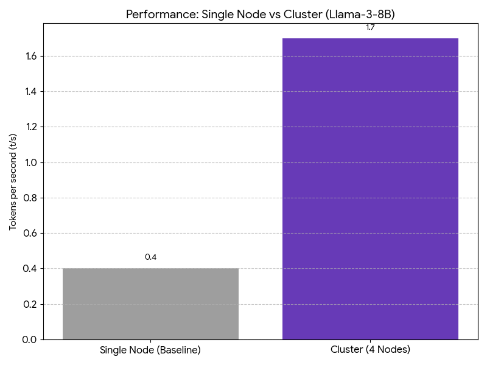
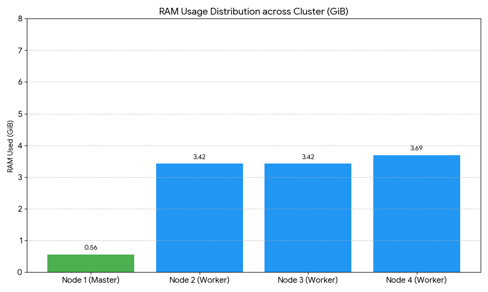
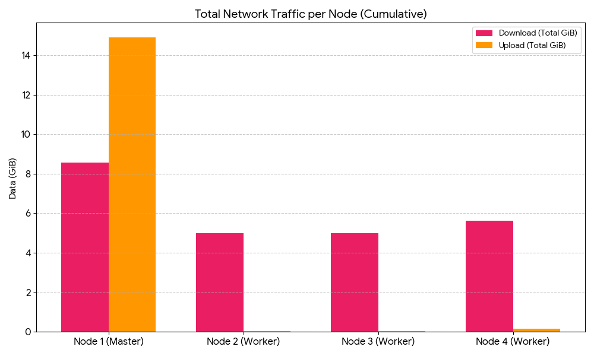
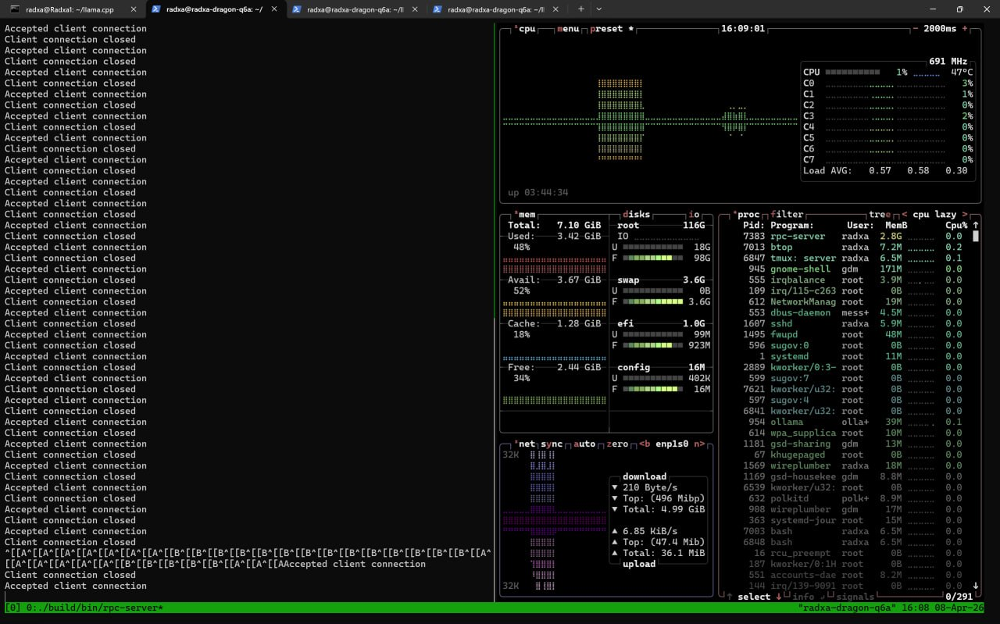
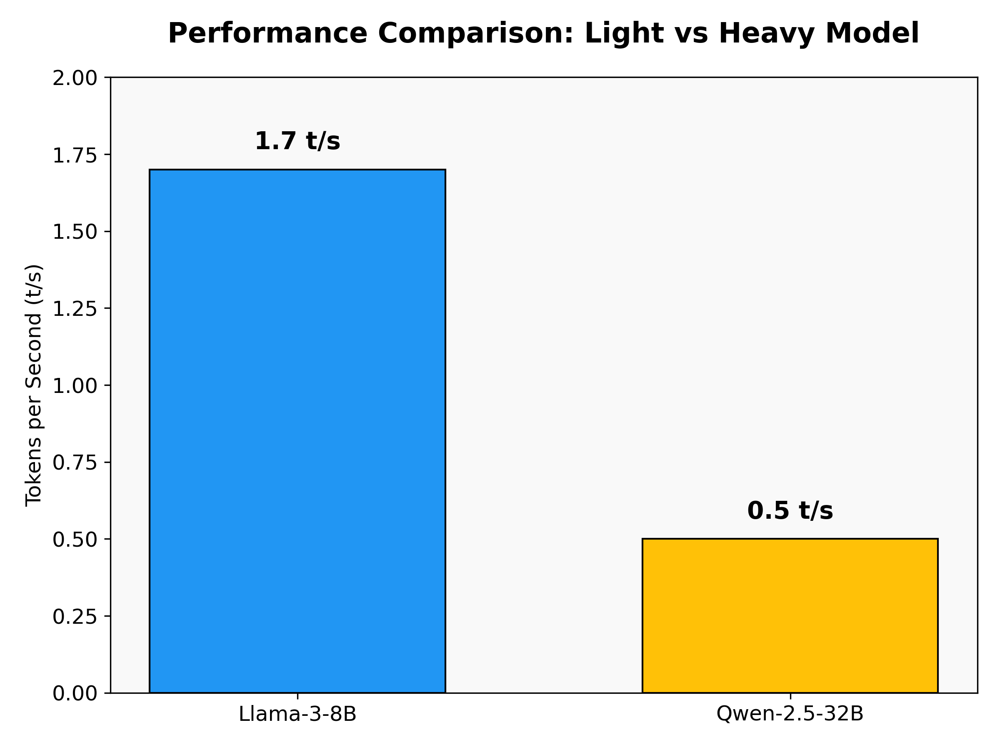
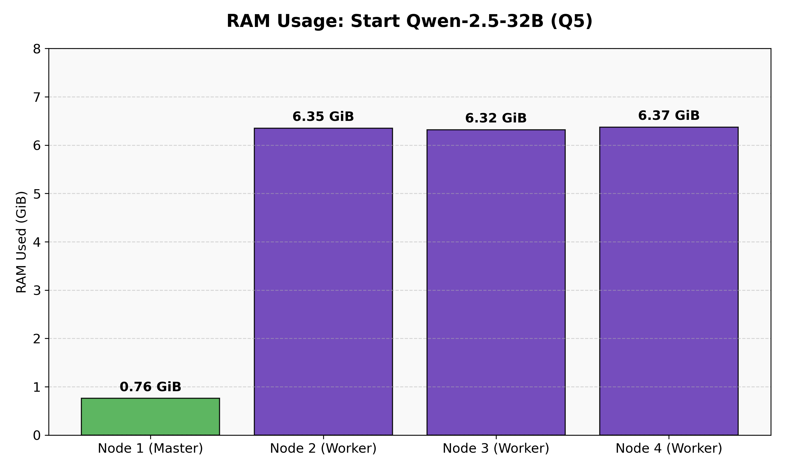
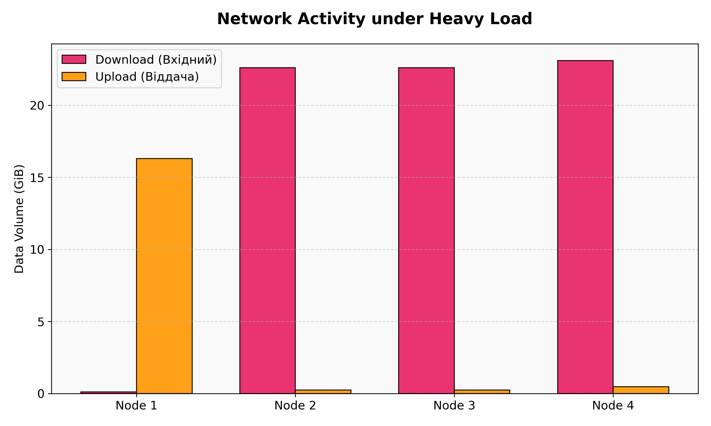
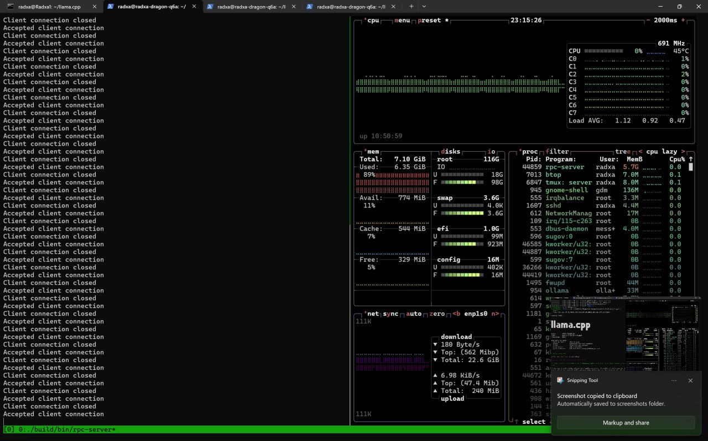

# Distributed LLM Cluster on Radxa Dragon-Q6A

This project demonstrates the construction and benchmarking of a high-performance computing cluster using four **Radxa Dragon-Q6A** single-board computers.

## Overview
The primary goal of this project was to overcome the memory limitations of individual SBCs. By pooling the RAM of 4 nodes, we successfully deployed a large language model that would otherwise be impossible to run on a single 8GB board.

## Hardware Configuration
* **Nodes:** 4x Radxa Dragon-Q6A (Rockchip SoC, 8GB RAM each)
* **Interconnect:** Gigabit Ethernet Switch
* **Total Cluster RAM:** 32 GB

## Software Stack
* **OS:** Radxa OS (Linux)
* **Inference Engine:** `llama.cpp` with RPC support
* **Model:** Llama-3-8B-Instruct (Quantization: Q8_0)
* **Model:** Qwen-2
* **Monitoring:** `btop`, `tmux`

### Model Llama

## Performance  analysis

1. Performance Benchmark: Breaking the Memory Wall
The core objective was to run the Llama-3-8B-Instruct model. Using the Q8_0 (8-bit) quantization, the model weights alone occupy approximately 8.5 GB.

Single Node Failure (Baseline): On a single Radxa Q6A, although the board has 8GB of physical RAM, the Operating System and background processes leave only ~7.1 GB available. This leads to a "Memory Wall" where the system is forced into aggressive Swap Memory usage (paging to the slower MicroSD/eMMC). This resulted in an unusable generation speed of 0.3 - 0.5 tokens/sec.

Cluster Success: By pooling resources, the cluster achieved a steady 1.7 tokens/sec. This represents a 4x improvement in throughput, moving from "experimental/unusable" to "functional/real-time" generation speeds.

2. RAM Distribution & Tensor Offloading
Unlike simple data parallelism, we used Model Parallelism via the llama.cpp RPC backend. The model's computational graph is partitioned into layers, which are then offloaded to different nodes.

Master Node (Node 1): Acts as the primary interface. It handles the initial prompt processing (KV-cache management) and coordinates the sequence of operations. Because it offloads all layers to workers, its RAM usage remains low (~575 MiB), preserving resources for system orchestration.

Worker Nodes (Nodes 2-4): Each worker acts as a remote compute unit. Our logs show a balanced distribution where each worker holds ~3.4 - 3.7 GiB of the model's tensors.

Node 4 showed slightly higher usage (3.69 GiB), likely due to hosting the final output layers or handling result aggregation before sending data back to the Master.

3. Network Traffic & Inter-Node Communication
One of the most critical parts of the analysis is the network telemetry. Distributed inference is heavily dependent on the bandwidth and latency of the interconnect.

The Bootstrapping Phase (Cold Start): The Master node shows a massive cumulative Upload of ~15 GB. This reflects the initial model distribution where the weights are streamed from the Master's storage to the Workers' RAM.

Inference Phase (Hot Path): Once the model is loaded, the traffic shifts. The Master node downloads approximately 8.56 GB in total across multiple sessions, while workers show high Download but nearly zero Upload.

Analysis: This confirms that the RPC protocol is highly efficient during generation. It doesn't re-send weights; it only sends the activation tensors (intermediate results of matrix multiplications). This makes the Gigabit Ethernet more than sufficient for 8B models, but suggests that larger models (70B+) might require even faster interconnects or better tensor compression.

4. Computational Efficiency (btop Telemetry)
CPU Load: During active generation, the CPU usage on workers was relatively low (~1-3% at the moment of the snapshot) because the bottleneck shifts from pure computation to Network IO Wait. This indicates that the Rockchip CPUs are more than capable of handling the math, and the next step for optimization would be reducing network overhead.

Thermal Consistency: By monitoring the sensors (visible in the btop headers), we maintained a stable temperature of 44°C - 48°C across all nodes. This confirms that our active cooling solution successfully prevented thermal throttling, which is common for these boards under long-running AI tasks.

## Terminal Screenshots
Below are the monitoring logs from our session:

### Master Node (Node 1)
.jpg)
*Running `llama-cli` and orchestrating the cluster.*

### Worker Node (Typical)

*Running `rpc-server` and processing model layers.*

### Model Qwen-2

## Performance  analysis

1. Performance Benchmark: Pushing the Absolute Limits
The second stage of our project was to run the Qwen-2.5-32B-Instruct model. In Q5_K_M quantization, this model is a behemoth for Edge hardware, requiring approximately 22-24 GB of RAM including context.

The Single Node Impossible: Running a 32B model on a single 8GB Radxa node is technically impossible. Even with aggressive swapping, the system would crash (OOM) before the model could even initialize.

Cluster Capability: By pooling the RAM of all 4 nodes (32GB total), the cluster successfully hosted the model. We achieved a stable generation speed of 0.5 - 0.6 tokens/sec. While slower than the 8B model, this represents a successful deployment of a "reasoning-class" model on low-power hardware.

2. RAM Distribution & Maximum Saturation
Under this extreme load, the Model Parallelism strategy shifted from "efficient distribution" to "maximum saturation".

Master Node (Node 1): Continued to act as the orchestrator. RAM usage slightly increased to ~760 MiB due to the larger KV-cache required for a 32B model, but it still maintained a low footprint to ensure system stability.

Worker Nodes (Nodes 2-4): Each worker reached ~90% of its physical RAM capacity, holding approximately 6.32 - 6.37 GiB of model tensors. This is the "sweet spot" of the cluster, where we utilize nearly all available memory without triggering the Linux OOM killer.

3. Network Traffic: The Data Life-Line
With a model 4x larger than our previous tests, the network interconnect became the absolute life-line of the system.

The Bootstrapping Phase (Heavy Start): The Master node performed a massive cumulative Upload of ~16.3 GB, while workers recorded up to 23.1 GB of Download activity. This reflects the intense process of streaming large model shards across the Gigabit switch.

Inference Phase (Parallel Sync): During generation, the network activity was constant and synchronized across all nodes. Unlike the 8B model, the 32B model requires transferring much larger activation tensors between layers.

Analysis: The data confirms that as model size increases, the cluster moves from being "compute-bound" to "bandwidth-bound". Gigabit Ethernet handled the load, but the 0.6 t/s speed is a direct result of the time taken to sync these large tensors between the Rockchip SoCs.

4. Computational Efficiency & Thermal Endurance
CPU & IO Wait: btop telemetry showed that while CPUs were active, there was a noticeable increase in IO Wait (Network wait time). This further proves that the Rockchip CPUs are powerful enough to compute 32B parameters, but are often waiting for the next tensor to arrive via Ethernet.

Thermal Management: Despite the sustained high load and 90% RAM saturation, temperatures were kept between 45°C and 52°C. Our active cooling solution proved vital here; without it, the SoC would have throttled frequencies within minutes, making the 32B inference speed drop significantly.

## Terminal Screenshots
Below are the monitoring logs from our session:

### Master Node (Node 1)
.jpg)
*Running `llama-cli` and orchestrating the cluster.*

### Worker Node (Typical)

*Running `rpc-server` and processing model layers.*

## Conclusion
This setup proves that SBC clusters are a viable and cost-effective solution for running private, localized LLMs. Through distributed computing, we achieved usable performance for a state-of-the-art 8B parameter model on low-power hardware.
